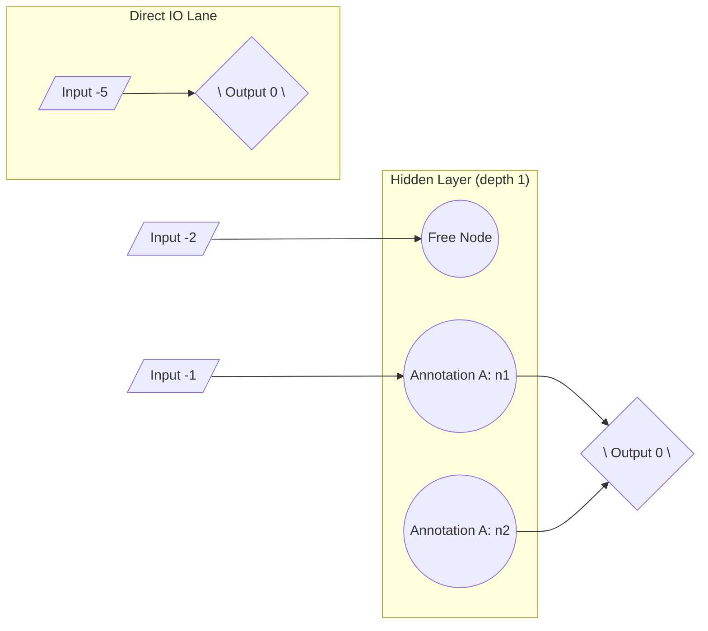

# React Interactive Explorer Requirements

This document captures the functional and technical requirements for the React-based interactive network explorer that complements the existing Pyvis view.

## Goals

- Provide a richer, more maintainable UI while keeping the zero-install “open the generated HTML file” workflow.
- Mirror (and improve) the current filtering + annotation experience.
- Keep Pyvis (`ni-py`) available for comparison or as a fallback.

## Functional Requirements

1. **Launch Flow**
   - `genome_explorer_cli ni` generates a folder (or single HTML file) that embeds the React bundle and serialized genome data.
   - Output must open directly via `file://.../genome_network_<id>.html` without a local server.

2. **Graph Rendering**
   - Show input, hidden, and output nodes with styling cues similar to Pyvis.
   - Support weighted, directed edges, including skip connections and direct input→output edges.
   - Use deterministic layout derived from the serialized `position` hints but allow drag-to-adjust within the session.

3. **Filters & Highlighting**
   - Checkboxes for:
     - “Show direct connections”
     - Each annotation (show/hide)
   - Filters update nodes + edges immediately.

4. **Annotation Panel**
   - Toggle button shows the panel.
   - List existing annotations with edit/delete/export placeholders (exact create/edit POST flow can remain a future enhancement but UI scaffolding is required).
   - Show metadata (name, hypothesis, node/edge counts).

5. **Selection State**
   - Clicking nodes/edges highlights them and updates the “selected items” display.
   - Provide visual feedback consistent with annotation builder expectations.

6. **Export Helpers**
   - Keep “Export Annotation” and “Export All” CTA placeholders that surface Python snippets (same behavior as Pyvis view).

## Non-Functional Requirements

- **Offline friendly:** No remote CDN dependencies; bundle produced during development and checked into repo.
- **Performance:** Handle typical NEAT genomes (hundreds of nodes/edges) smoothly.
- **Accessibility:** Controls must be keyboard accessible and readable with default theme.
- **Documentation:** Update README + arc42 docs with build steps, data contract, and troubleshooting tips.

## Data Contract Snapshot

Generated JSON must include:

- `nodes`: `{ id, label, type, depth, color, annotations[], isDirectConnection, position: {x,y} }`
- `edges`: `{ id, from, to, weight, color, annotations[], isDirectConnection, isSkip }`
- `annotations`: `{ id, name, hypothesis, nodes[], edges[] }`
- `metadata`: `{ genomeId, generatedAt, layout: { type } }`

Exact schema details live in `docs/arc42/react_explorer_schema.md`.

## Pyvis Layout Expectations

- Layered layout now respects annotation boundaries by keeping member nodes contiguous within each depth slice.
- Deterministic ordering feeds both Pyvis and React so drags start from the same baseline layout.
- Direct input→output connections render along a dedicated bottom lane to declutter the main hidden layers.
- Layout metadata should keep broadcasting these hints so future renderers stay visually consistent.

### Layout Sketch

## Open Questions / Future Enhancements

- In-browser annotation editing & persistence back to the CLI/database.
- Additional visual cues (heatmaps, legends, weight sliders).
- Theme customization / dark mode.
